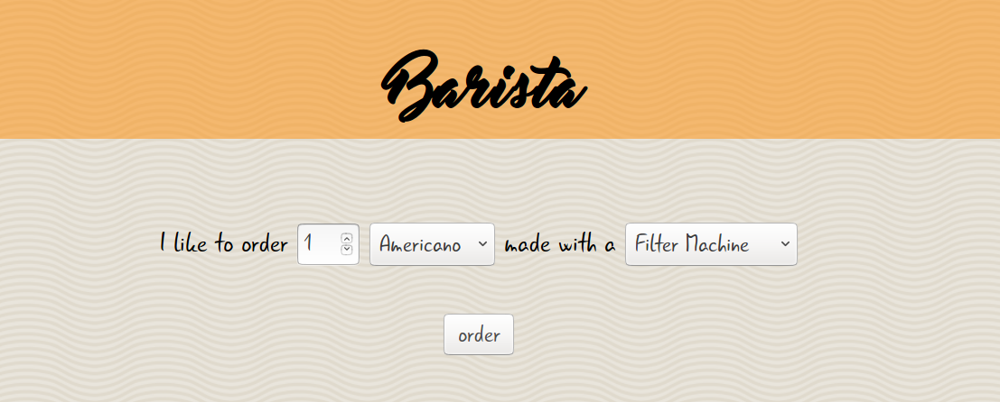

# Barista

This is the famous Barista service.

You can order:

|Coffee|Price\*|
|----|----|
|Americano|1.50€
|Cappuccino|2.00€
|Espresso|1.30€
|~~Latte Macchiato~~|2.20€
|Moccaccino|2.30€

\* prices change according to their preparation process

# About
Learning about docker and jenkins by running state-less webservers. This example application was crafted for learning purpose as part of a lecture about continuous integration (CI) and delivery (CD) at the Cologne University of Applied Sciences (TH Köln).

# Getting Started
This is an example webserver with docker, python3 and flask.

**install** git and docker, if you don't have it yet:

git

    https://git-scm.com/book/en/v2/Getting-Started-Installing-Git
    
or even a fancy git tool with a GUI

    https://git-scm.com/downloads/guis
    
docker

    https://docs.docker.com/linux/step_one/

**build** a docker image of the webserver:

    git clone https://github.com/swiesend/barista barista
    cd barista
    docker build -t barista .
    
**run** it in a docker container (e.g. on port 5000):

    docker run -d -p 5000:5000 barista

**use** the app in your favorite browser and play around:

    http://localhost:5000

# Configuration

*NOTICE:*

    This webserver configuration is not for production use!

For production use a configuration which might be more like this:

https://realpython.com/blog/python/dockerizing-flask-with-compose-and-machine-from-localhost-to-the-cloud/

# Issues

This example issues are here for training with jenkins.

## [todo] Setup a post-receive hook for Jenkins with GitHub plugin

ok, let's setup a hook:

* go to the repository `Settings`
* click `Webhooks & services` on the left
* click `Add service` button
* type `Jenkins (GitHub plugin)``
* enter the following url to Jenkins hook url

    http://78.46.74.23:8080/github-webhook/

you should see something like this as response on the top:

    Okay, that hook was successfully created.

done!

## [bug] Missing 'Latte Macchiato'

Oh, no the 'Latte Macchiato' is missing. A customer has raised an issue to this topic. Please fix the problem.

**check** the coffee module to find a solution:

    barista/coffee.py
